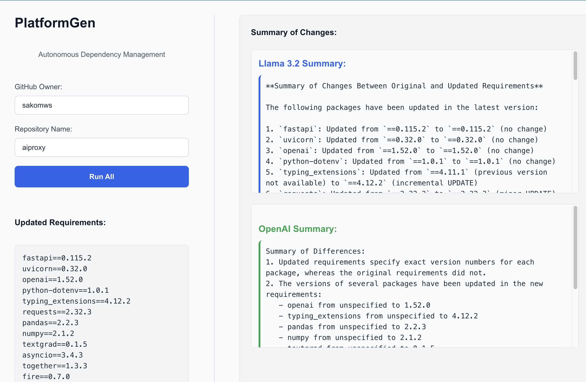

**PlatformGen - Autonomous Dependency Manager**

- Draft PR created: https://github.com/sakomws/aiproxy/pull/54

# Motivation
- Regular upgrades of infrastructure services are essential to mitigate vulnerabilities and enhance performance.
- Focus on building sustainable, long-term solutions rather than short-term patches.
- Efficient updates prevent system failures and ensure smooth operations.

# Problems
- Managing dependencies is hard as your codebase grows .
- Time-consuming for teams.
- Higher costs & increased risk of system failures.
- Difficult to scale as services grow.
- Slower development cycles.

# How big is the problem...
- For Fortune 1,000 companies, downtime could cost as much as $1 mln per hour (IDC survey). 
- While the typical mid-sized company spends $1 mln per year on incidents, large enterprises can spend up to $60 mln or more (IHS Research Report).

# Solution
- Progressive automation maturity from manual assistance to full automation​.

# Team
[Sako M](https://www.linkedin.com/in/sakom)
[Julian Saks](https://www.linkedin.com/in/juliansaks)
  
# Reference
https://github.com/renovatebot/renovate
https://github.com/dependabot
https://deps.dev
