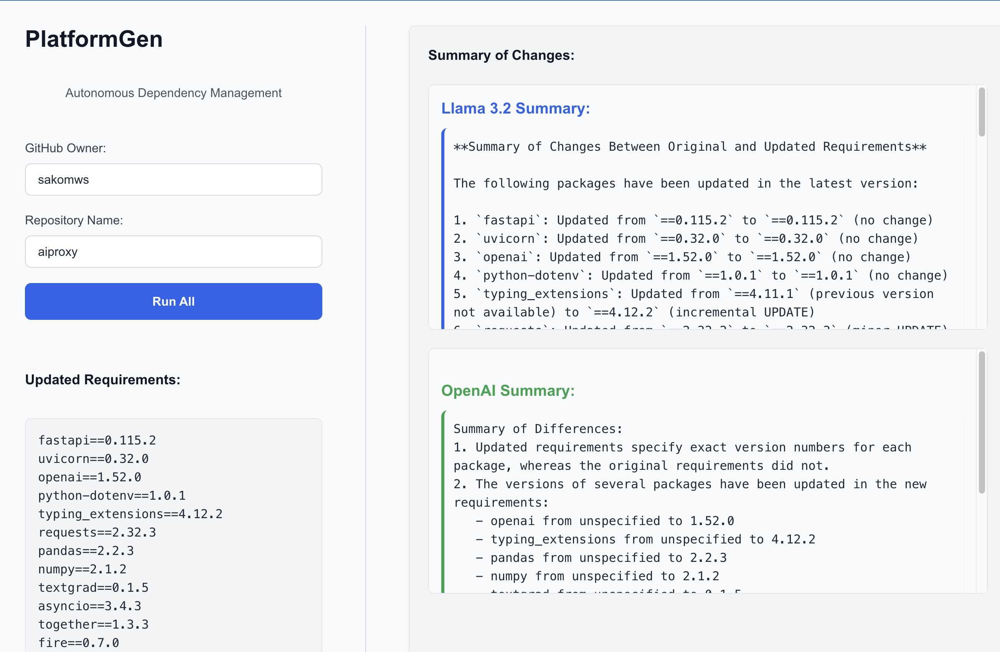
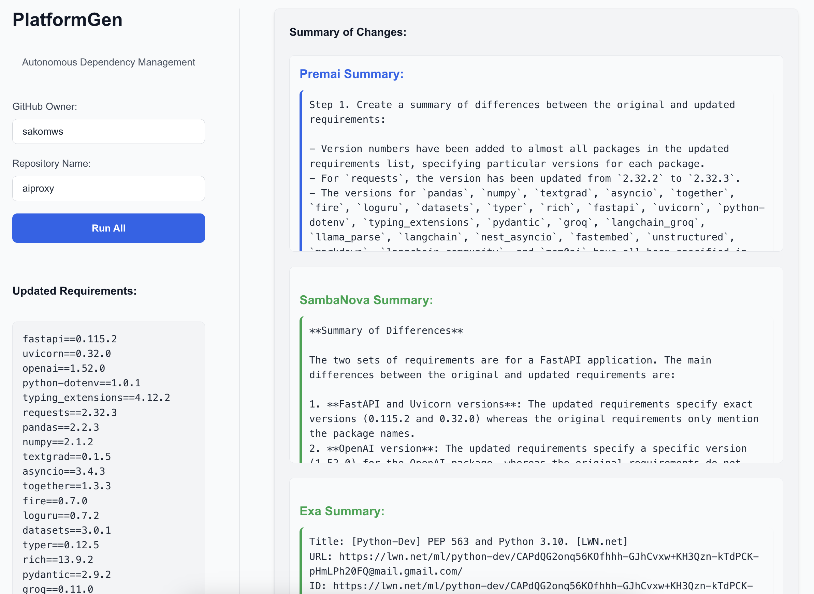

**PlatformGen - Autonomous Dependency Manager**

- Draft PR created: https://github.com/sakomws/aiproxy/pull/54

# Motivation
- Regular upgrades of infrastructure services are essential to mitigate vulnerabilities and enhance performance.
- Focus on building sustainable, long-term solutions rather than short-term patches.
- Efficient updates prevent system failures and ensure smooth operations.

# Problems
- Managing dependencies is hard as your codebase grows .
- Time-consuming for teams.
- Higher costs & increased risk of system failures.
- Difficult to scale as services grow.
- Slower development cycles.

# How big is the problem...
- For Fortune 1,000 companies, downtime could cost as much as $1 mln per hour (IDC survey). 
- While the typical mid-sized company spends $1 mln per year on incidents, large enterprises can spend up to $60 mln or more (IHS Research Report).

# Architecture

[GitHub](https://github.com/)

- Utilized for fetching repository data, accessing files, and creating commits and pull requests.
- Managed authentication using personal access tokens.

[OpenAI](https://openai.com/)

- Used gpt-3.5-turbo model to generate a summary of differences between software package requirements.
- Helps in comparing original and updated requirements.txt files.

[Premai](https://www.premai.io/)

- Integrated to provide additional summaries using gpt-4-turbo.
- Supports multiple steps in generating a structured summary of requirement changes.

[SambaNova](https://www.sambanova.ai/)

- Connects via API to use the Meta-Llama-3.2-3B-Instruct model for creating another version of the summary.
- Provides a diverse set of summarization capabilities.

[Groq](https://www.groq.com/)

- Engages with the llama-3.2-3b-preview model.
- Complements the summarization task with custom parameters like temperature and tokens.

[EXA AI](https://www.exa.com/)

- Provides neural search and content generation for dependencies on the web, X.
- Enhances the summarization process by fetching context from external sources.

# Team
- [Sako M](https://www.linkedin.com/in/sakom)
- [Julian Saks](https://www.linkedin.com/in/juliansaks)
  
# Reference
- https://github.com/renovatebot/renovate
- https://github.com/dependabot
- https://deps.dev
